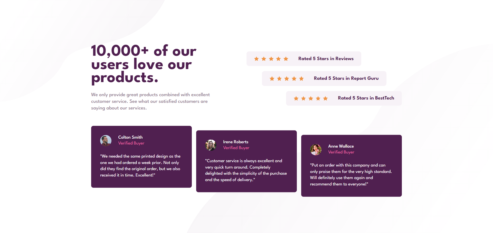

# Frontend Mentor - Social proof section solution

This is a solution to the [Social proof section challenge on Frontend Mentor](https://www.frontendmentor.io/challenges/social-proof-section-6e0qTv_bA). Frontend Mentor challenges help you improve your coding skills by building realistic projects. 

## Table of contents

- [Overview](#overview)
  - [The challenge](#the-challenge)
  - [Screenshot](#screenshot)
  - [Links](#links)
- [My process](#my-process)
  - [Built with](#built-with)
  - [What I learned](#what-i-learned)
- [Author](#author)

## Overview

### The challenge

Users should be able to:

- View the optimal layout for the section depending on their device's screen size

### Screenshot



### Links

- Solution URL: [Add solution URL here](https://your-solution-url.com)
- Live Site URL: [Add live site URL here](https://your-live-site-url.com)

## My process

### Built with

- Semantic HTML5 markup
- CSS 
- Flexbox
- CSS Grid
- Sass (Variables, Nesting, Mixins)
- Mobile-first workflow
- JavaScript

### What I learned

This is my first challenge using Sass, I applied a few features like variables, nesting and mixins to avoid repeating classes and styles. I had a little trouble changing the position for each stars review at the beggining, since I wanted to make them all same size but it ended having different widths on bigger screens, although I think it doesn't look that bad. 

The positioning for the testimonials was a little bit different, I couldn't use the same solution because I made their container a grid with responsive columns, so the positioning depended of wheter it has the 3 columns or not, so I wrote a script where I can check that.

```css for positioning ratings
  .ratings {
    display: grid;
  }

  .rating {
    max-width: 445px;
  }

  .rating:first-child {
    justify-self: start;
  }
  .rating:nth-child(2) {
    justify-self: center;
  }
  .rating:last-child {
    justify-self: end;
  }
```
```js for positioning testimonials
  const columns = window.getComputedStyle(grid).getPropertyValue("grid-template-columns").split(" ").length;

  for(i = 0, offsetY = 1; i < testimonials.length; i++){
          if(i != 0){
              testimonials[i].style.transform = (columns == 3) ? `translateY(${offsetY}em)` : "translateY(0)";
              offsetY++;
          }
      }
```

## Author

- Frontend Mentor - [@Kriosaber](https://www.frontendmentor.io/profile/Kriosaber)